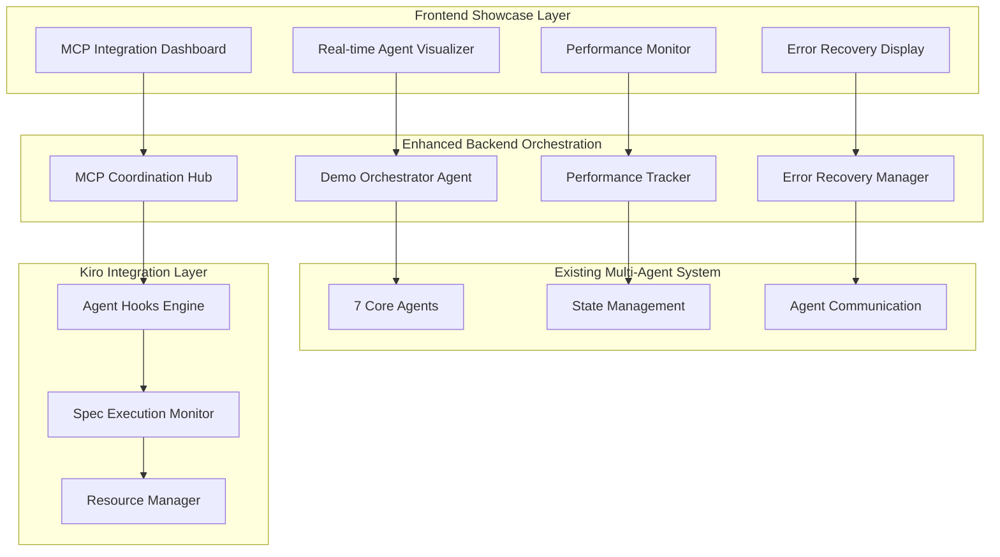

# Design Document

## Overview

The Hackathon Demo Features system transforms FeynmanCraft ADK into a comprehensive showcase of Kiro's advanced multi-agent orchestration capabilities. This design implements real-time agent visualization, intelligent error recovery demonstrations, advanced MCP integration showcases, and automated workflow management through Agent Hooks. The system serves as both a functional physics diagram generator and a technical demonstration platform for sophisticated AI collaboration patterns.

## Architecture

### High-Level Architecture



### Component Integration Strategy

The design enhances the existing FeynmanCraft ADK architecture without disrupting core functionality, adding demonstration layers that showcase Kiro's unique capabilities while maintaining full backward compatibility.

## Components and Interfaces

### 1. Real-time Agent Visualization System

**Purpose**: Showcase sophisticated multi-agent orchestration with live visual feedback

**Components**:
- `AgentCollaborationGraph`: Interactive network visualization of agent relationships
- `LiveProgressTracker`: Real-time progress indicators for each agent
- `DataFlowVisualizer`: Shows data passing between agents with animated transitions
- `ParallelProcessingDisplay`: Visualizes concurrent agent operations

**Key Interfaces**:
```typescript
interface AgentVisualizationState {
  agents: AgentStatus[];
  connections: AgentConnection[];
  dataFlow: DataFlowEvent[];
  performance: PerformanceMetrics;
}

interface AgentStatus {
  id: string;
  name: string;
  status: 'idle' | 'processing' | 'completed' | 'error';
  progress: number;
  currentTask: string;
  processingTime: number;
  memoryUsage: number;
}
```

### 2. Intelligent Error Recovery Demonstration

**Purpose**: Showcase advanced error handling and self-correction capabilities

**Components**:
- `ErrorRecoveryOrchestrator`: Manages correction loops and fallback strategies
- `CorrectionLoopVisualizer`: Shows iterative improvement processes
- `FallbackStrategyManager`: Demonstrates alternative approach selection
- `ErrorAnalysisEngine`: Provides detailed failure analysis and suggestions

**Key Interfaces**:
```typescript
interface ErrorRecoveryState {
  errorType: string;
  correctionAttempts: CorrectionAttempt[];
  fallbackStrategies: FallbackStrategy[];
  recoverySuccess: boolean;
  learningOutcomes: string[];
}

interface CorrectionAttempt {
  attemptNumber: number;
  strategy: string;
  agentsInvolved: string[];
  result: 'success' | 'partial' | 'failure';
  improvements: string[];
}
```

### 3. Advanced MCP Integration Showcase

**Purpose**: Demonstrate sophisticated external tool orchestration and coordination

**Components**:
- `MCPCoordinationHub`: Central coordinator for all MCP server interactions
- `ToolOrchestrationEngine`: Manages complex tool workflows
- `MCPPerformanceMonitor`: Tracks tool usage and performance
- `FallbackToolManager`: Handles tool failures and alternative selection

**Key Interfaces**:
```typescript
interface MCPShowcaseState {
  activeServers: MCPServerStatus[];
  toolInvocations: ToolInvocation[];
  coordinationPatterns: CoordinationPattern[];
  performanceMetrics: MCPPerformanceData;
}

interface ToolInvocation {
  toolName: string;
  serverName: string;
  parameters: any;
  result: any;
  executionTime: number;
  success: boolean;
}
```

### 4. Agent Hooks Automation Engine

**Purpose**: Showcase automated workflow management and productivity enhancement

**Components**:
- `AutomationHookManager`: Manages all automated workflows
- `KnowledgeBaseUpdater`: Automatically updates physics knowledge base
- `FormatGenerationHook`: Automatically generates multiple output formats
- `DebuggingReportGenerator`: Creates automated debugging reports

**Key Interfaces**:
```typescript
interface HookExecutionState {
  activeHooks: HookStatus[];
  automationTriggers: TriggerEvent[];
  executionResults: HookResult[];
  productivityMetrics: ProductivityData;
}

interface HookStatus {
  hookId: string;
  name: string;
  trigger: string;
  status: 'waiting' | 'executing' | 'completed';
  executionTime: number;
  impact: string;
}
```

### 5. Performance Optimization Display

**Purpose**: Demonstrate intelligent resource management and scalability

**Components**:
- `ResourceAllocationManager`: Shows intelligent resource distribution
- `LoadBalancingVisualizer`: Demonstrates model selection optimization
- `MemoryOptimizationTracker`: Shows resource cleanup and optimization
- `ScalabilityDemonstrator`: Handles multiple concurrent requests

**Key Interfaces**:
```typescript
interface PerformanceShowcaseState {
  resourceAllocation: ResourceAllocation;
  loadBalancing: LoadBalancingData;
  memoryOptimization: MemoryData;
  scalabilityMetrics: ScalabilityData;
}

interface ResourceAllocation {
  cpuUsage: number;
  memoryUsage: number;
  agentPoolSize: number;
  queueLength: number;
  throughput: number;
}
```

## Data Models

### Enhanced State Management

```typescript
interface DemoShowcaseState extends FeynmanCraftState {
  visualization: AgentVisualizationState;
  errorRecovery: ErrorRecoveryState;
  mcpShowcase: MCPShowcaseState;
  hookExecution: HookExecutionState;
  performance: PerformanceShowcaseState;
  demoMetrics: DemoMetrics;
}

interface DemoMetrics {
  totalAgentInteractions: number;
  errorRecoverySuccessRate: number;
  mcpToolsUsed: number;
  hooksExecuted: number;
  performanceImprovements: string[];
  impressiveFeatures: string[];
}
```

### Agent Communication Enhancement

```typescript
interface EnhancedAgentMessage extends AgentMessage {
  visualizationData?: VisualizationMetadata;
  performanceData?: PerformanceMetadata;
  demoRelevance?: DemoRelevanceScore;
}

interface VisualizationMetadata {
  shouldHighlight: boolean;
  animationType: 'pulse' | 'glow' | 'flow' | 'bounce';
  displayDuration: number;
  importance: 'low' | 'medium' | 'high' | 'critical';
}
```

## Error Handling

### Demonstration-Enhanced Error Recovery

1. **Showcase Error Types**:
   - LaTeX compilation failures with detailed correction loops
   - Physics validation inconsistencies with multi-agent resolution
   - MCP tool failures with intelligent fallback selection
   - Resource constraints with graceful degradation

2. **Recovery Strategies**:
   - **Iterative Correction**: Show 3-attempt correction loops with learning
   - **Agent Collaboration**: Demonstrate cross-agent problem solving
   - **Fallback Mechanisms**: Show alternative tool and approach selection
   - **Learning Integration**: Capture and apply lessons from failures

3. **User Experience**:
   - Real-time error visualization with clear explanations
   - Progress indicators during recovery attempts
   - Educational content about AI problem-solving strategies
   - Success celebration when recovery completes

## Testing Strategy

### Demonstration Scenario Testing

1. **Agent Collaboration Scenarios**:
   - Complex physics processes requiring all 7 agents
   - Error injection to trigger correction loops
   - Resource constraint simulation
   - Concurrent request handling

2. **MCP Integration Testing**:
   - Tool failure simulation and recovery
   - Performance optimization under load
   - Fallback strategy validation
   - External service integration reliability

3. **Hook Automation Testing**:
   - Trigger condition validation
   - Automation execution reliability
   - Impact measurement accuracy
   - User productivity enhancement verification

4. **Performance Showcase Testing**:
   - Load testing with multiple concurrent users
   - Resource optimization validation
   - Scalability demonstration scenarios
   - Memory management effectiveness

### Demo Reliability Assurance

1. **Failsafe Mechanisms**:
   - Backup demonstration data for offline scenarios
   - Graceful degradation when external services fail
   - Manual override capabilities for critical demo moments
   - Recovery procedures for unexpected failures

2. **Performance Guarantees**:
   - Maximum response times for demo scenarios
   - Minimum success rates for error recovery
   - Resource usage limits to prevent system overload
   - Consistent behavior across different environments

## Integration Points

### Frontend Enhancement Integration

- **React Component Extensions**: Enhance existing components with visualization capabilities
- **Real-time Data Streaming**: WebSocket integration for live updates
- **Interactive Demonstrations**: User-controlled demo scenarios
- **Performance Monitoring**: Built-in metrics collection and display

### Backend Orchestration Integration

- **Agent Wrapper Enhancement**: Add demonstration metadata to existing agents
- **State Management Extension**: Enhance existing state with demo tracking
- **MCP Coordination**: Centralized MCP server management and monitoring
- **Hook Integration**: Seamless integration with Kiro's Agent Hooks system

### Kiro Platform Integration

- **Spec Execution Monitoring**: Live tracking of spec-driven development
- **Hook Automation**: Demonstration of automated workflow management
- **Resource Management**: Integration with Kiro's resource optimization
- **Development Productivity**: Showcase of enhanced development workflows